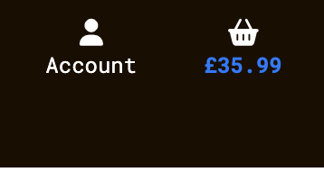

# Testing 

## Table of Contents   
* [User Stories](#user-stories)
* [Validation](#validation)
    * [HTML](#html)
    * [CSS](#css)
    * [JavaScript](#javascript)
    * [Flake8](#flake8)
* [Lighthouse](#lighthouse)
* [Browser Compatibility](#browser-compatibility)
* [Responsiveness](#responsiveness)
* [Notable Bugs](#notablebugs)

## User Stories

### Site Admin
#### ID 1
* Expected
  * Site owner has access to store backend so that they can manage products, recipes and events.

* Testing
    <details><summary>Site Owner Testing: Backend Access</summary>
      
      
    </details>

* Result
  * The site owner or admins(superusers) have access to an additional 'Admin' menu in the navbar when they login. This is in addition to edit and delete options connected to individual products, recipes and events.

&nbsp;

#### ID 2
* Expected
  * Site owner privliges are restriced to admins only.

* Testing
    <details><summary>Site Owner Testing: Restricted Access</summary>
      
    </details>

* Result
  * Only admins have access to full CRUD functionality for site products, recipes and events.

&nbsp;

#### ID 3
* Expected
  * Site admins can add, edit and delete products on the site.

* Testing
    <details><summary>Site Owner Testing: Products</summary>
      
      
      
    </details>

* Result
  * Only admins have access to full CRUD functionality for site products.

&nbsp;

#### ID 4
* Expected
  * Site admins can add, edit and delete recipes on the site.

* Testing
    <details><summary>Site Owner Testing: Recipes</summary>
      
      
      
    </details>

* Result
  * Only admins have access to full CRUD functionality for site recipes.

&nbsp;

#### ID 5
* Expected
  * Site admins can add, edit and delete events on the site.

* Testing
    <details><summary>Site Owner Testing: Events</summary>
      
      
      
    </details>

* Result
  * Only admins have access to full CRUD functionality for site events.

&nbsp;

### Viewing & Navigation
#### ID 6
* Expected
  * Site user can easily see the purpose of the site and be informed as to whether it meets their needs.

* Testing
    <details><summary>Site User Testing: Purpose</summary>
      
    </details>

* Result
  * The homepage navbar, image, text, and 'Shop Now' button combine to inform the user of the site purpose.

&nbsp;

#### ID 7
* Expected
  * Site user can browse the full range of products, view the selection and make a purchase.

* Testing
    <details><summary>Site User Testing: Product Browsing</summary>
      
    </details>

* Result
  * The products page lists a selection of products to all users which can be clicked for further information and to make a purchase.

&nbsp;

#### ID 8
* Expected
  * Site user can view individual product details and identify the price, description and image.

* Testing
    <details><summary>Site User Testing: Product Details</summary>
      
    </details>

* Result
  * The product detail page displays such as price, description and an image to the use.

&nbsp;

#### ID 9
* Expected
  * Site user can see a running total for their basket and be informed as to how much they're spending.

* Testing
    <details><summary>Site User Testing: Basket Total</summary>
      
    </details>

* Result
  * The basket total, on the navbar, is highlighted in blue when there's something in the basket and auto-updates the price as items are added or removed.

&nbsp;

#### ID 10
* Expected
  * Site user can browse the full selection of recipes.

* Testing
    <details><summary>Site User Testing: Recipe Browsing</summary>
      
    </details>

* Result
  * The recipes page lists a selection of recipes to all users which can be clicked for further information.

&nbsp;

#### ID 11
* Expected
  * Site user can view individual recipe details to see the recipe method and find linked products.

* Testing
    <details><summary>Site User Testing: Recipe Details</summary>
      
    </details>

* Result
  * The recipe detail page displays the recipe method and links to related products.

&nbsp;

#### ID 12
* Expected
  * Site user can browse the full range of events and find any local events that interest them.

* Testing
    <details><summary>Site User Testing: Events Browsing</summary>
      
    </details>

* Result
  * The events page lists a selection of events to all users which expand to expose further information.

&nbsp;

### Sorting & Searching
#### ID 13
* Expected
  * Site user can easliy sort the list of products available and find products by price or name.

* Testing
    <details><summary>Site User Testing: Sort Products</summary>
      
    </details>

* Result
  * The sort dropdown, on the products page, allows users to sort products by price or name.

&nbsp;

#### ID 14
* Expected
  * Site user can easily sort products by category and narrow products down to the most relevant.

* Testing
    <details><summary>Site User Testing: Sort Categories</summary>
      
    </details>

* Result
  * The catagories badges, under the header on the products page, allows users to sort products by category.

&nbsp;

#### ID 15
* Expected
  * Site user can search products by name or description and find a specific product.

* Testing
    <details><summary>Site User Testing: Search Bar</summary>
      
    </details>

* Result
  * The search bar allows the user to search all products by name or description.

&nbsp;

#### ID 16
* Expected
  * Site user can view a filtered products list based on their search.

* Testing
    <details><summary>Site User Testing: Search Results</summary>
      
    </details>

* Result
  * The search results are shown as a filtered list on the products page.

&nbsp;

### Basket & Checkout
#### ID 17
* Expected
  * Site user can easliy add products to their basket and compile a selection of products to purchase.

* Testing
    <details><summary>Site User Testing: Add to Basket</summary>
      
    </details>

* Result
  * The 'Add to Basket' button, on the products page, allows users to add one or multiple products to their basket.

&nbsp;

#### ID 18
* Expected
  * Site user can view the products in their basket to see what they have selected and adjust if needed.

* Testing
    <details><summary>Site User Testing: Basket</summary>
      
    </details>

* Result
  * Clicking on the basket icon, in the navbar, brings the user to the basket page where they can view and adjust the items in their basket and totals.

&nbsp;

#### ID 19
* Expected
  * Site user can easily enter their delivery and payment details allowing for a quick and hassel free purchase.

* Testing
    <details><summary>Site User Testing: Checkout</summary>
      
    </details>

* Result
  * The checkout page contains a form in which a guest user can enter their delivery details. Registered users can save their default information to negate the need to enter it each time they make a purchase.

&nbsp;

#### ID 20
* Expected
  * Site user can see their order confirmation after checkout and verify that the order details are correct.

* Testing
    <details><summary>Site User Testing: Order Confirmation</summary>
      
    </details>

* Result
  * The checkout success page confirms that the order has been placed and provides an order summary. A success toast message is also displayed to the user.

&nbsp;

#### ID 21
* Expected
  * Site user will recieve an order confirmation email to keep order details for their records.

* Testing
    <details><summary>Site User Testing: Order Confirmation Email</summary>
      
    </details>

* Result
  * Upon completion of the purchase, and email is sent to the user to confirm that it has been successfully placed and provides a summary.

&nbsp;

### Registration & User Accounts
#### ID 22
* Expected
  * Site user can easliy register for a new account and	have a personal profile.

* Testing
    <details><summary>Site User Testing: Register</summary>
      
    </details>

* Result
  * By selecting the 'Profile' dropdown, in the navbar, users will have the option of registering which will bring them to a sign-up page.

&nbsp;

#### ID 23
* Expected
  * Registered users recieve a verification email during registration so that they can be confident that their registration was successful.

* Testing
    <details><summary>Site User Testing: Email Verification</summary>
      
    </details>

* Result
  * When a valid sign-up form has been submitted, an email verification email is sent to the user allowing them to complete their registration.

&nbsp;

#### ID 24
* Expected
  * Registered users can easliy sign in and out of their accout.

* Testing
    <details><summary>Site User Testing: Sign in & Out</summary>
      
    </details>

* Result
  * Sign in and out buttons are easily available at all times form the 'Account' dropdown in the navbar.

&nbsp;

#### ID 25
* Expected
  * Registered users can recover their email if they forget it.

* Testing
    <details><summary>Site User Testing: Password Recovery</summary>
      
    </details>

* Result
  * Under the 'Sign In' button on the sign in page, there is a link to a password recovery page which sends a recovery email to the user's email address.

&nbsp;

#### ID 26
* Expected
  * Registered users have a personal user profile which shows their order history and default delivery details.

* Testing
    <details><summary>Site User Testing: Profile</summary>
      
    </details>

* Result
  * The user's profile is easily accessible at all times form the 'Account' dropdown in the navbar. This contains their order history and default delivery information, which they can update.

&nbsp;

#### ID 27
* Expected
  * Registered users can keep a list of their favourite products.

* Testing
    <details><summary>Site User Testing: Favourites</summary>
      
    </details>

* Result
  * The user's favourites list is easily accessible at all times form the 'Account' dropdown in the navbar. This contains basic information on each product and links to it. They can also remove products from thir favourites here.

&nbsp;

[Back to top &uarr;](#testing)

# Validation

## HTML
The [W3C Markup Validation Service](https://validator.w3.org/#validate_by_input) was used to validate the code. The code was successfully validated with no errors or warnings.

<details><summary>Homepage</summary>

</details>

<details><summary>Products</summary>

</details>

<details><summary>Product Detail</summary>

</details>

<details><summary>Add Product</summary>

</details>

<details><summary>Edit Product</summary>

</details>

<details><summary>Recipes</summary>

</details>

<details><summary>Recipe Detail</summary>

</details>

<details><summary>Add Recipe</summary>

</details>

<details><summary>Edit Recipe</summary>

</details>

<details><summary>Events</summary>

</details>

<details><summary>Add Event</summary>

</details>

<details><summary>Edit Event</summary>

</details>

<details><summary>Profile</summary>

</details>

<details><summary>Favourites</summary>

</details>

<details><summary>Basket</summary>

</details>

<details><summary>Checkout</summary>

</details>

<details><summary>Checkout Success</summary>

</details>

&nbsp;

## CSS
The [W3C CSS Validation Service](https://jigsaw.w3.org/css-validator/#validate_by_uri) was used to validate the code. The code was successfully validated with no errors or warnings.

<details><summary>Base</summary>

</details>

<details><summary>Checkout</summary>

</details>

<details><summary>Profiles</summary>

</details>

&nbsp;

## JavaScript
[JSHint](https://jshint.com/) was used to check if the JavaScript code complies with coding rules. The code was successfully validated with no errors or warnings. The 'Stripe Elements' code comes from [Stripe](https://stripe.com/docs/payments/accept-a-payment) and was flagged for having one undefinded variable 'Stripe' on line 10.

<details><summary>Add or Edit</summary>

</details>

<details><summary>Quantity Input</summary>

</details>

<details><summary>Scroll to Top</summary>

</details>

<details><summary>Sort Selector</summary>

</details>

<details><summary>Stripe Elements</summary>

</details>

<details><summary>Update or Remove Qty Script</summary>

</details>

&nbsp;

[Back to top &uarr;](#testing)

## Flake8
[Flake8](https://flake8.pycqa.org/en/latest/) was used to check if the Python code is PEP 8 compliant. The code was successfully processed by the linter with the only errors found relating to django files and migrations.


&nbsp;

[Back to top &uarr;](#testing)

## Lighthouse
[Lighthouse](https://developer.chrome.com/docs/lighthouse/overview/) was used to audit performance, accessibility, best practices and SEO.

### Desktop


&nbsp;

### Mobile


&nbsp;

[Back to top &uarr;](#testing)

## Browser Compatibility
[LambdaTest](https://www.lambdatest.com/) was used to test the site across a number of browsers, including:

### Chrome
<details><summary>Windows OS</summary>

</details>

<details><summary>Android OS</summary>

</details>

&nbsp;

### Safari
<details><summary>macOS</summary>

</details>

<details><summary>iOS</summary>

</details>

&nbsp;

### Firefox: Windows
<details><summary>Windows OS</summary>

</details>

<details><summary>Android OS</summary>

</details>

&nbsp;

### MS Edge:
<details><summary>Windows OS</summary>

</details>

&nbsp;

[Back to top &uarr;](#testing)

## Responsiveness
[Chrome DevTools](https://developer.chrome.com/docs/devtools/) was used to test the responsiveness of the site.

<details><summary>Homepage</summary>

</details>

<details><summary>Products</summary>

</details>

<details><summary>Recipes</summary>

</details>

<details><summary>Events</summary>

</details>

<details><summary>Favourites</summary>

</details>

<details><summary>Profile</summary>

</details>

<details><summary>Basket</summary>

</details>

<details><summary>Checkout</summary>

</details>

&nbsp;

[Back to top &uarr;](#testing)

## Notable Bugs

### Checkout App: Order model
During the development of the project I was recieving the TypeError message shown below.


After researching TypeError: "unsupported operand type(s) for +: 'decimal.Decimal' and 'float'" I managed to track the issue down to the deliver_cost value, set to 3.99, in the Order model and how that was being used to calculate the grand total. It was being caused as I was trying to add a Decimal and a float.
```
def update_total(self):
    # Update grand total each time a line item is added
    self.order_total = self.lineitems.aggregate(Sum('lineitem_total'))['lineitem_total__sum'] or 0
    self.grand_total = self.order_total + self.delivery_cost
    self.save()
```

The simplest solution I found ws to rewrite any reference to delivery_cost declaring it as a Decimal object:
```
    self.grand_total = self.order_total + Decimal(self.delivery_cost)
```

&nbsp;

### Events App: EventForm
During the development of the project, the EditForm class, refrenced in the edit_event view, was not pulling through the event date and time data from the Event model.


All other information was being pulled through apart from the event date and time. There were no issues found in the add_event view and I confirmed in the admin that a value for both date and time existed. After testing and researching the issue, it was discovered that the issue was being casued by the date and time format that was being used in the form. The bug stemmed from the code below, from the EventForm:
```
class Meta:
        model = Event
        fields = '__all__'
        widgets = {
            'date': DateInput(),
            'time': TimeInput(),
        }
```

This issue was resolved by supplying both DateInput and TimeInput with the required format, as below.
```
class Meta:
        model = Event
        fields = '__all__'
        widgets = {
            'date': DateInput(format=('%Y-%m-%d')),
            'time': TimeInput(format=('%H:%M:%S')),
        }
```

&nbsp;

### HTML Validation: Base Templates
During HTML code validation, I was recieving an error, coming from the base templates, stating that the site had duplicate IDs for 'user-options'. 


This ID was coming from the 'Account' dropdown in the navbar, this was the only instance of 'user-options' used as an ID in the base.html file. However, it was also used in the mobile-top-header template which was being imported into the base template.
```
base.html

<a class="text-white nav-link" href="#" 
    id="user-options" data-toggle="dropdown" aria-haspopup="true" aria-expanded="false">
    <div class="text-center">
        <div><i class="fa-solid fa-user fa-lg"></i></div>
        <p class="my-0">Account</p>
    </div>
</a>

mobile-top-header.html

<a class="nav-link text-white d-block d-lg-none" href="#" 
    id="user-options" data-toggle="dropdown" aria-haspopup="true" aria-expanded="false">
    <div class="text-center">
        <div><i class="fa-solid fa-user fa-lg"></i></div>
        <p class="my-0">Account</p>
    </div>
</a>
```

This issue was resolved by changing the ID in the mobile top header template to 'user-menu'.
```
<a class="nav-link text-white d-block d-lg-none" href="#" 
    id="user-menu" data-toggle="dropdown" aria-haspopup="true" aria-expanded="false">
    <div class="text-center">
        <div><i class="fa-solid fa-user fa-lg"></i></div>
        <p class="my-0">Account</p>
    </div>
</a> 
```

&nbsp;

### Events App: Toast Messages
During the testing of the project, it was noticed that toast messages weren't appearing when adding, editing or deleting events from the site. This was unusual as toasts were appearing for almost everything else and were coming from the base template. I used print statemenets to check the code in the events views, all of which seemed okay. Using Google DevTools it was discovered that while the toasts were being rendered in the html, they were not being given the requsite 'show' class.


The 'show' class was being added by jQuery in the base template but it was discovered that the  in the events template was replacing it.
```



```

This issue was resolved by including {{ block.super }} in the postloast JS in the events template.
```

{{ block.super }}


```

&nbsp;

[Back to top &uarr;](#testing)

[Back to README.md doc](README.md)